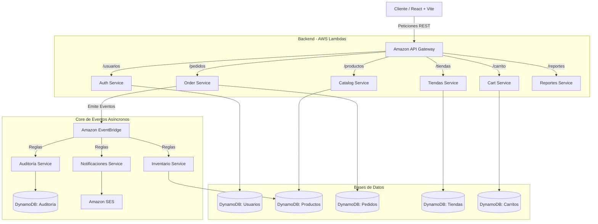

# CloudShop Enterprise

CloudShop es una plataforma web serverless de comercio electrónico de nivel empresarial, diseñada para ser altamente escalable, segura y disponible. Su arquitectura desacoplada utiliza una infraestructura como código (IaC) administrada por **Terraform** y microservicios en **TypeScript/Node.js** desplegados como funciones **AWS Lambda** tras un **Amazon API Gateway**.

---

## Arquitectura de la Solución

El sistema sigue un enfoque serverless basado en microservicios desacoplados:



- **Frontend**: SPA construida en **React, TypeScript y TailwindCSS**, alojada en **S3** y distribuida por **CloudFront CDN** con protección perimetral **WAF**.
- **Seguridad**: Autenticación mediante **JSON Web Tokens (JWT)** con validación descentralizada en Lambdas mediante middlewares reutilizables.
- **Mensajería y Eventos**: **Amazon EventBridge** coordina el procesamiento asíncrono para desacoplar operaciones críticas (ej. actualización de existencias y notificaciones).

---

## Estructura del Proyecto

```text
Cloudshop/
├── backend/               # Código fuente del Backend (TypeScript + Node.js)
│   ├── src/               # Lógica de microservicios
│   │   ├── auth/          # Servicio de Autenticación y Usuarios
│   │   ├── catalog/       # Catálogo de Productos
│   │   ├── orders/        # Procesamiento de Pedidos
│   │   ├── cart/          # Gestión de Carritos de Compra
│   │   ├── tiendas/       # Administración de Tiendas
│   │   ├── reports/       # Reportes e Inteligencia de Ventas (Dashboard)
│   │   ├── events/        # Handlers asíncronos (inventario, auditoría, notificaciones)
│   │   └── shared/        # Utilidades compartidas (respuestas, middleware de autenticación)
│   ├── dist/              # Código empaquetado en .zip listo para desplegar
│   ├── build.ps1          # Compilador automatizado para PowerShell
│   └── package.json       # Dependencias del backend
├── frontend/              # Aplicación Web SPA
│   ├── src/
│   │   ├── components/    # Componentes comunes de diseño
│   │   ├── context/       # Estados globales (Auth, Carrito)
│   │   ├── services/      # Abstracción de llamadas API (apiFetch, mappings)
│   │   └── views/         # Vistas principales (Catálogo, Panel, Gestión, Pedidos)
│   ├── vite.config.ts     # Configuración de compilación y Proxy de desarrollo
│   └── .env               # Parámetros de entorno del Frontend
└── infraestructure/       # Código de Infraestructura (IaC - Terraform)
    ├── modules/           # Módulos Terraform (cómputo, seguridad, base de datos, CDN)
    └── main.tf            # Plan general de aprovisionamiento
```

---

## Desarrollo Local (Frontend)

Para simplificar el desarrollo local y **evitar bloqueos de políticas CORS** en el navegador, el servidor de desarrollo de Vite está configurado para actuar como un proxy inverso.

### 1. Configuración de Entorno
Crea o edita el archivo [frontend/.env](file:///c:/Users/Laptop1/OneDrive/Desktop/Cloudshop/frontend/.env):
```env
VITE_API_BASE_URL=/api
```

### Mecanismo de Proxy en Vite
El archivo [vite.config.ts](file:///c:/Users/Laptop1/OneDrive/Desktop/Cloudshop/frontend/vite.config.ts) intercepta las peticiones a `/api` y las redirige hacia la infraestructura en la nube:
```typescript
server: {
  proxy: {
    '/api': {
      target: 'https://q5povgck6h.execute-api.us-east-1.amazonaws.com/dev',
      changeOrigin: true,
      rewrite: (path) => path.replace(/^\/api/, ''),
    },
  },
}
```

### Iniciar el Entorno Local
Instala dependencias e inicia el servidor de desarrollo:
```bash
cd frontend
npm install
npm run dev
```
La aplicación estará disponible en `http://localhost:5173/` sin problemas de CORS.

---

## Compilación y Despliegue en AWS

### Paso 1: Compilar Backend
Navega a la carpeta `backend/` y compila los bundles listos para AWS Lambda:
```powershell
cd backend
npm install
./build.ps1
```
*Si tienes problemas de políticas de ejecución de scripts en Windows, abre una terminal PowerShell como administrador y ejecuta: `Set-ExecutionPolicy -ExecutionPolicy RemoteSigned -Scope Process`*.

### Paso 2: Desplegar Infraestructura
Navega a la carpeta `infraestructure/` para aprovisionar los recursos mediante Terraform:
```powershell
cd ../infraestructure
terraform init
terraform plan
terraform apply
```
*Escribe `yes` para confirmar el despliegue.*

Al finalizar, anota los outputs del CLI:
- `URL_SITIO_WEB`: Dominio de CloudFront para acceder a la aplicación.
- `s3_bucket_name`: Nombre del bucket S3 para alojar el frontend.

### Paso 3: Subir Frontend a Producción
Sube el frontend compilado directamente al bucket S3 usando AWS CLI:
```powershell
cd ../frontend
npm run build
aws s3 sync ./dist/ s3://<NOMBRE_DE_TU_BUCKET_S3> --delete
```

---

## Referencia de la API REST

Los endpoints expuestos a través de Amazon API Gateway y sus microservicios encargados:

| Método | Endpoint | Roles Permitidos | Descripción |
|---|---|---|---|
| **POST** | `/usuarios` | Público / Admin | Registro de nuevos usuarios (Clientes es libre, Admin/Operador requiere Admin) |
| **POST** | `/usuarios/login` | Público | Autenticación y obtención de JWT |
| **GET** | `/usuarios` | Admin, Operador | Consulta de la lista de usuarios activos |
| **GET** | `/usuarios/{id}` | Propietario, Admin, Operador | Consulta detallada del perfil de un usuario |
| **PUT** | `/usuarios/{id}` | Propietario, Admin | Edición de rol, estado (Admin) o datos personales (Nombre/Password) |
| **DELETE**| `/usuarios/{id}` | Admin | Desactivación lógica de un usuario (`estado = INACTIVO`) |
| **GET** | `/productos` | Público | Obtiene el catálogo de productos disponibles |
| **POST** | `/productos` | Admin, Operador | Registra un nuevo producto en el catálogo global |
| **PUT** | `/productos/{id}` | Admin, Operador | Actualiza stock, precio o datos del producto |
| **DELETE**| `/productos/{id}` | Admin | Elimina físicamente un producto del catálogo |
| **GET** | `/pedidos` | Admin, Operador, Cliente | Listado de pedidos (los clientes solo ven sus propios pedidos) |
| **POST** | `/pedidos` | Cliente | Generación de una orden de compra (emite evento a EventBridge) |
| **PUT** | `/pedidos/{id}` | Admin, Operador | Modificación del estado logístico del pedido |
| **DELETE**| `/pedidos/{id}` | Cliente | Cancelación de pedidos que se encuentren en estado `Pendiente` |
| **GET** | `/reportes` | Admin | Indicadores clave, analítica de ventas y ranking de clientes |

---

## 🧹 Limpieza de Recursos

Para eliminar toda la infraestructura y evitar costos recurrentes en AWS:
```powershell
cd infraestructure
terraform destroy
```
*Confirma escribiendo `yes` en la consola.*